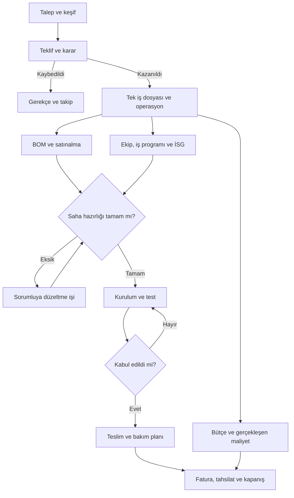

# BIEM-ONE işleyiş ve kural haritası

4 Ekim 2026, kaynak tabanı `7e7ce10`. **Bu belge hedef davranışı tarif eder.** Aşağıdaki mevcut/hedef ayrımı korunur; henüz uygulanmamış kontrol ürün özelliği gibi sunulmaz.

## Hedef

Bir müşteri talebini tekliften teslim ve bakıma kadar tek İş Dosyasında izlemek; sıradaki işi, sorumlusunu, eksiklerini ve gerçek maliyetini görünür tutmak. Bir kazanılan Project için yalnız bir ProjectOperation bulunur. İK, satınalma ve teknik çalışma bu dosyaya bağlanır.

Bu hedef ilişkilerin görünümüdür. Mevcut operasyon aşama sırası bu belgeyle değiştirilmez; satınalma, ekip hazırlığı ve finans işleri gerektiğinde aynı anda ilerleyebilir.

## Kaynak incelemesinde görülen durum

| Alan | Mevcut davranış | Eksik |
| --- | --- | --- |
| Satış aşaması | İzinli geçişler, müşteri/sorumlu şartı, gerekçeli geri dönüş ve tek operasyon | Teklif revizyonu/onayı ve tüm zorunlu keşif maddelerini geçişte denetleme |
| Operasyon | Aşama sırası ve zaman çizelgesi var | `advanceOperation` İSG, teslim/kabul kanıtı veya hazırlık koşullarını denetlemiyor |
| Keşif kontrol listesi | Kategoriye göre maddeler ve tamamlanma kaydı | `isRequired` bilgisi tek başına aşama engeli oluşturmuyor |
| Satınalma | BOM, yönetici onayı, sipariş, kısmi teslim, fazla/eşzamanlı teslim denetimi | Teslim fişi, iade, stok ve işlem tekrar anahtarı |
| Personel / İK | Özlük, ücret dönemleri, belge/geçerlilik, onaylı puantaj maliyeti | Projeye ekip atama, saha tarihi için belge uygunluğu, izin/masraf onayı |
| Kabul ve finans | Aşama adları mevcut | İmzalı kabul, dosya revizyonu, fatura ve tahsilat kayıtlarının esaslı denetimi |

Kaynaklar: `apps/api/src/modules/projects/projects.service.ts`, `workflow-templates.ts`, `apps/api/src/modules/procurement/`, `apps/api/src/modules/personnel/`, `apps/api/prisma/schema.prisma` ve `scripts/acceptance.mjs`.

## Hedef geçiş kuralları

Sorumlu iş rolünü ifade eder. Bugünkü hesap rolleri SUPER_ADMIN, COMPANY_ADMIN, PROJECT_MANAGER ve FIELD_ENGINEER'dır; aşağıdaki ticari/teknik rollerin tamamı ayrı kullanıcı yetkisi olarak mevcut değildir.

| Adım | Sorumlu / onay | Gerekli kayıt veya koşul | Sonuç / eksikte davranış |
| --- | --- | --- | --- |
| Talep → keşif | İş sahibi | Müşteri, kategori, sorumlu, ihtiyaç ve hedef tarih | Eksik alanlara doğrudan bağlantı; ikinci iş dosyası açılmaz |
| Keşif → teklif | Teknik sorumlu + iş sahibi | Kategoriye göre keşif, varsayımlar, maliyet girdileri, teknik revizyon | Eksik zorunlu madde listelenir; fiyat onayı ayrı işlem olur |
| Teklif → kazanıldı | Şirket yöneticisi | Teklif revizyonu, tutar/para birimi, müşteri karar veya sipariş referansı | Aynı Project'e tek operasyon; ret/kayıp gerekçesi saklanır |
| Hazırlık → satınalma | Operasyon sorumlusu | Aktif sorumlu, iş programı tarihleri, sıradaki aksiyon | Eksik hazırlık açıkça görünür; W01 yalnız görünürlük sağlar |
| BOM → sipariş | Satınalma hazırlayan + yetkili yönetici | Tedarikçi, miktar/birim, para birimi, fiyat ve onay | Tutar sunucuda hesaplanır; onaysız sipariş yetkisi tanımlı olmalıdır |
| Sipariş → teslim alma | Teslim alan | Sipariş kalemi, alınan miktar, tarih; ikinci fazda fiş | Kısmi teslim korunur; fazla teslim reddedilir; iade ayrı olaydır |
| İş programı → saha hazırlığı | Proje yöneticisi + İK yetkilisi | Projeye atanmış ekip, planlanan saha günleri, proje belge gereklilikleri | Atanmamış ekip veya tanımsız gereklilik otomatik uygun sayılmaz |
| İSG → kurulum | Proje yöneticisi, belge kontrolü İK yetkilisinde | Atanan personelin saha tarihleri boyunca geçerli ve kontrol edilmiş belgeleri; saha izinleri | Eksikler kapatılmadan saha onayı verilemez; maaş ve özel belge içeriği saha ekranına taşınmaz |
| Kurulum → test | Teknik sorumlu | Kurulum görevleri, cihaz/seri kaydı, teknik revizyon ve ölçüm planı | Açık kritik kusur test hazırlığında görünür |
| Test → SAT/kabul | Teknik sorumlu + kabul sorumlusu | Ölçüm koşulları, cihaz/kalibrasyon, proje özelindeki kriter ve sonuç | Başarısız ölçüm düzeltme işine döner; evrensel RF eşik değeri uydurulmaz |
| Kabul → teslim | Proje yöneticisi | Kabul sonucu, yetkili onay/imza kaydı, teslim dosyası, açık kusur kararları | Belge revizyonu ve onay geçmişi korunur |
| Fatura / tahsilat | Finans yetkilisi | Tutar/para birimi, fatura veya ödeme referansı, vade ve kısmi ödemeler | Fatura kesildi ile para tahsil edildi farklı durumlardır |
| Kapanış / bakım | Şirket/proje yöneticisi | Kapanış özeti, kalan finansal durum, garanti ve bakım kapsamı/tarihleri | Bakım gerekiyorsa sorumlu ve tarihli takip işi oluşur |

## Ortak kurallar

1. Her işte sıradaki aksiyon, sorumlu ve hedef tarih bulunur. Yapılamayan işin engeli ve çözüm sorumlusu görünür olur.
2. Geçiş kontrolü sunucudadır. Arayüz aynı sonucu gösterir; eşzamanlı iki istek aşama atlamasına veya iki kayıt oluşturmaya yol açmaz.
3. Gereken bilgi bulunamıyorsa sonuç **bilinmiyor/eksik** olur. Yükleme hatası veya henüz geliştirilmemiş denetim yeşil uygunluk göstermez.
4. Geri dönüş gerekçesi, aktör ve zaman saklanır; geçmiş teslim/ödeme/onay olayları silinmez.
5. Gerçek maliyet, tahmin ve satınalma taahhüdü ayrı raporlanır. Para birimleri kur/tarih kaydı olmadan toplanmaz; işçilik iki kere sayılmaz.
6. Personel ile giriş hesabı ayrı varlıklardır. Kullanıcı hesabı olmayan çalışan kaydedilebilir; pasif personel kartı otomatik hesap kapatma değildir.
7. Şirket sınırı tüm sorgu/yazmalarda uygulanır. İK ücret ve belge yetkileri proje yetkilerinden ayrıdır.
8. Yeni zorunlu geçiş kuralları eski işleri sessizce kilitlemez. Etkinleştirme sürümü, mevcut kayıtların ön incelemesi ve geri dönüş yolu uygulama paketinde tanımlanır.
9. Aynı ağ isteğinin tekrarı ayrı iş/teslim/ödeme sayılmaz. Bu güvence yalnız gerçekten uygulandığı uçlar için mevcut kabul edilir.

## İlk teslim ve sonrası

W01: mevcut kayıtlardan operasyon hazırlığını okuyup eksik alan ve düzeltme bağlantısı gösterme. **Saha uygunluğu onayı değildir; mevcut geçişleri değiştirmez.** Ayrıntı: `openspec/changes/operation-readiness/`.

W02: proje ekip ataması, proje belge gereklilikleri, saha tarihlerine göre değerlendirme ve kontrollü etkinleştirilen geçiş engelleri. Belge revizyon/onay geçmişi ve proje kullanıcılarına açıklanacak güvenli özet bu işin parçasıdır.

Diğer teslimler ve kabul ölçütleri: `../NEXT_WORK.md`. Kaynak repo değerlendirmesi: `WORKFLOW_REPO_SUPPORT.md`.
